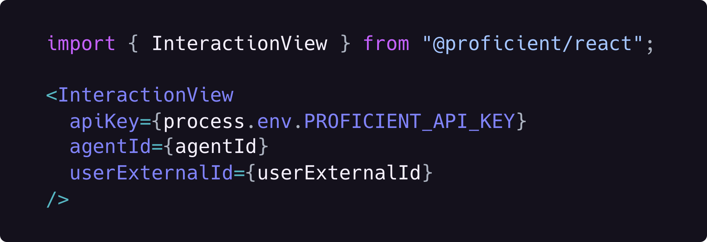

<h1 align="center">
  <a href="https://proficientai.com">
    Proficient AI
  </a>
</h1>

  Add a conversational AI agent to your app in 3 minutes.

Proficient AI is a platform that enables developers to add conversational AI agents to their apps in minutes. Our interaction APIs and SDKs coupled with our powerful web dashboard are the simplest way teams can add and operate LLM-powered agents for their end-user applications.

This repo contains the source code for Proficient's TypeScript-based SDKs including our React, Admin and Client SDKs.

    
    
    

  Currently available in private beta. Reach out for early access.

 

  

 

# Documentation

View the full documentation (docs) [here](https://docs.proficientai.com).

# Community

Join our Discord server [here](https://discord.gg/DVbwTM8erb).

# License

This project is made available under the AGPL-3.0 License.
